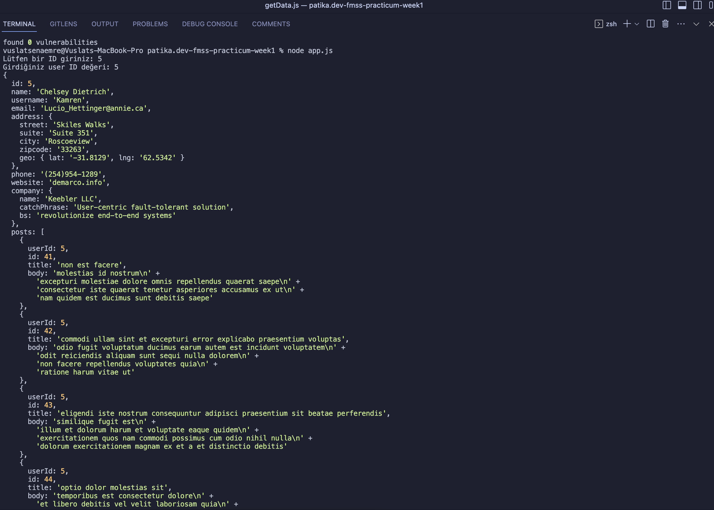

# 1. Ödev
Patika.dev &amp; FMSS Bilişim Front-end Practicum Week1 - Homework 1

## Installation
1. Clone the repository
2. `npm install` command to install dependencies
3. `npm start` command to run the application

## Assignment Requirements
- This function should be defined as "async" and exported as the default function. Asynchronous functions inside the function should be defined using "await".
- The function takes a single parameter of type Number which specifies the user id
- The function's task is to retrieve the data of the user with the given user id by sending a request to the following endpoint. You should use the "axios" library to make the requests. When making the request, you should replace the number at the end of the following endpoint with the user id parameter that is passed to the function.
- Inside the same function, another request for "posts" should be made for the same user id. Again, you need to use the "axios" library to make the request, and replace the number at the end of the following endpoint with the user id that comes as a parameter:
```javascript 
https://jsonplaceholder.typicode.com/posts?userId={user_id}
```
The data obtained from these two requests should be merged and returned as an object, as shown in the example in the description of the task.

```javascript
{
  id: user_id,
  name: user_name,
  username: user_username,
  email: user_email,
  posts: [
    {
      id: post_id,
      title: post_title,
      body: post_body
    },
    ...
  ]
}
```
## Result


